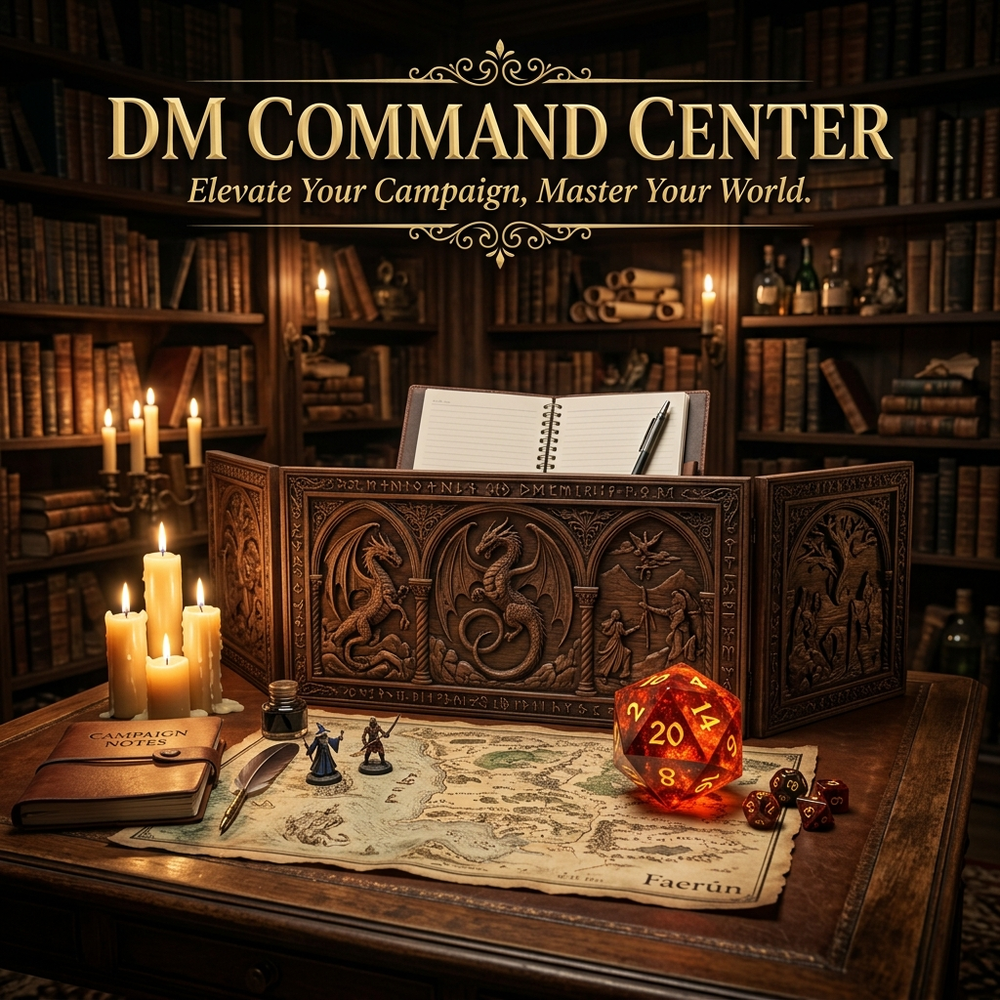
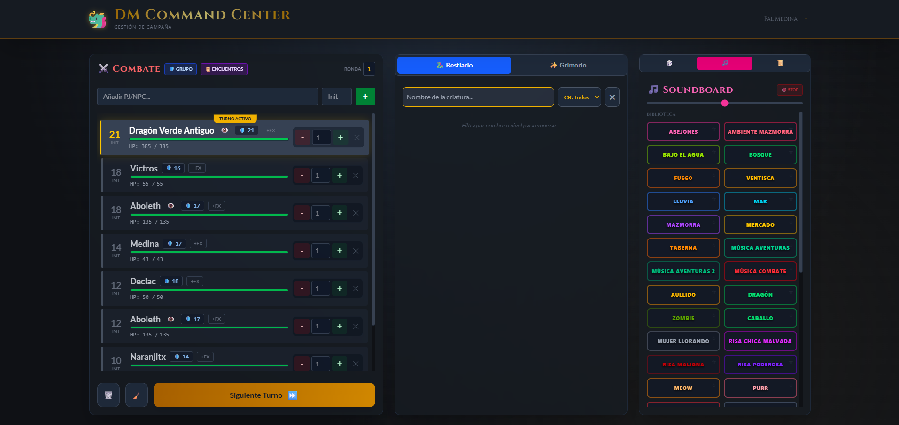

# ⚔️ DM Command Center

**DM Command Center** es la herramienta definitiva para Dungeon Masters de **D&D 5e**. Diseñada para simplificar la gestión de partidas, permitiéndote centrarte en la narrativa mientras la aplicación se encarga de la mecánica del juego.

🚀 **[Probar la Aplicación en Vivo](https://dm-dashboard-nine.vercel.app/)**

---

## ✨ Características Legendarias

### 🔴 Combat Tracker de Alto Rendimiento
*   **Gestión de Turnos Pro:** Ordenación automática de iniciativa y seguimiento de rondas.
*   **Vida y Salvaciones:** Control dinámico de HP y Death Saves integradas para PJs.
*   **Sistema de Estados (FX):** Aplica condiciones visuales (Cegado, Envenenado, etc.) con acceso rápido a sus reglas.
*   **Auto-Foco:** La interfaz sigue automáticamente al combatiente activo.

### ☁️ Persistencia Legado (Cloud Sync)
*   **Sincronización con Supabase:** Tu **Party** y tus **Notas** ya no se pierden al limpiar el navegador. Todo se guarda de forma segura en tu cuenta.
*   **Vista de Jugador en Tiempo Real:** Comparte un enlace para que tus jugadores vean el orden de iniciativa y el estado del combate en sus propios dispositivos.

### 🐉 Bestiario & Grimorio Integrado
*   **Búsqueda Instantánea:** Encuentra cualquier monstruo o hechizo oficial de la SRD en milisegundos.
*   **Importación en un Clic:** Añade criaturas directamente al combate con sus estadísticas (HP, AC e Iniciativa) calculadas automáticamente.

### 🎲 Dados del Destino (Epic Roll)
*   **Torre de Dados:** Sistema de tiradas con historial.
*   **Efectos Críticos:** Animaciones especiales y pulsos visuales para los **20 Naturales** y los pifias.

### 🎵 Soundboard Ambiental
*   **Atmósferas en Bucle:** Música de taberna, bosques oscuros y combate épico.
*   **Efectos de Sonido:** Rugidos, hechizos y momentos de tensión al alcance de un botón.

### 📜 Herramientas de Gestión
*   **Party Manager:** Guarda las fichas de tus jugadores para cargarlos en cualquier combate.
*   **Gestor de Encuentros:** Crea encuentros previos y lánzalos a la batalla con un solo botón.
*   **Bloc de Notas:** Bloc con autoguardado para no olvidar nombres improvisados o deudas de oro.

---

## 🛠️ Stack Tecnológico

*   **Frontend:** [React.js](https://reactjs.org/) con Hooks y Context API.
*   **Estilos:** [Tailwind CSS](https://tailwindcss.com/) con una estética Dark Fantasy.
*   **Backend & Auth:** [Supabase](https://supabase.com/) (PostgreSQL + Auth + Storage).
*   **Despliegue:** [Vercel](https://vercel.com/).
*   **Datos:** [D&D 5e API](https://www.dnd5eapi.co/).

---

## 📸 Vista de la Forja

---

## 👤 Autor

*   **Javier Paez** - [JaviPaez7](https://github.com/JaviPaez7)

---

> ¿Te gusta el proyecto? ¡Una ⭐️ en el repo me ayuda a seguir forjando herramientas para el gremio!